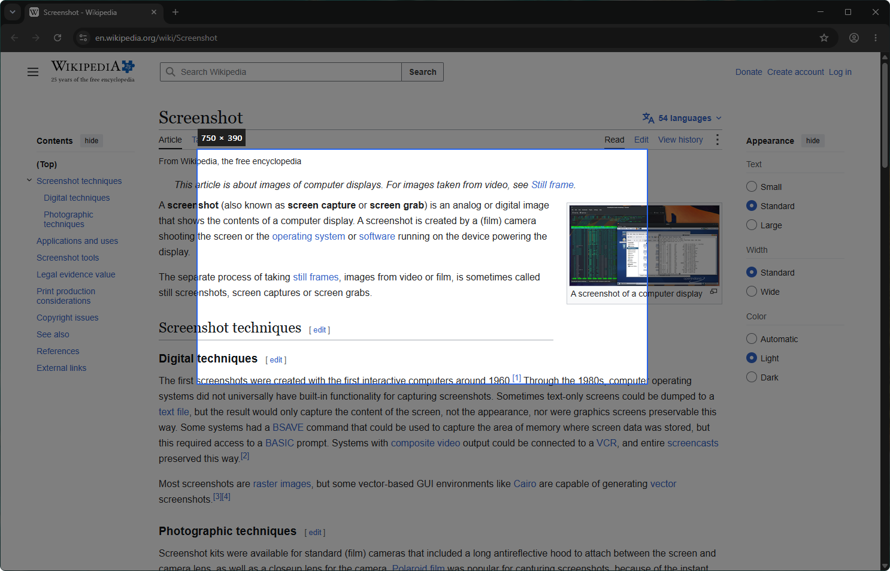

# SnapShot

A tiny Windows tool for grabbing part of the screen and handing it to an AI assistant such as
Claude Code. Press **PrintScreen**, drag a rectangle, let go — the selection is saved as a PNG and
the file's full path is on the clipboard, ready to paste.



## Features

- **PrintScreen to start.** The screen freezes and darkens; whatever was open at the moment you
  pressed the key — menus, tooltips — is in the picture.
- **Drag to select.** The selected area is shown at full brightness with its size in pixels.
  Escape or a right-click cancels; a click without dragging does nothing.
- **Saved and copied.** The PNG lands in Windows' own screenshot folder (the one Win+PrintScreen
  uses, so it follows you if you move that folder) and the path is copied as plain text:
  `C:\Users\you\Pictures\Screenshots\Screenshot_2026-10-03_16-45-12.png`.
- **Every monitor, any scaling.** One overlay per monitor, captured in physical pixels, so
  screenshots on a 150 % display are neither blurry nor offset.
- **Small and quiet.** A single 2.7 MB executable built with Native AOT — no .NET runtime to
  install, starts instantly, uses about 20 MB of memory and lives in the notification area.

## Requirements

- Windows 10 or 11, x64.
- To build: the [.NET 10 SDK](https://dotnet.microsoft.com/download) and, for Native AOT, the
  Visual Studio workload *Desktop development with C++* (it provides the linker).

### Windows 11 and Snipping Tool

Windows 11 opens Snipping Tool on PrintScreen by default. SnapShot takes the key first, but if
both open, turn it off under *Settings → Accessibility → Keyboard → Use the Print screen key to
open screen capture*. SnapShot shows a notification at startup when the setting is on.

## Install

```powershell
./publish.ps1
```

The script runs the tests, publishes with Native AOT, copies `SnapShot.exe` to
`G:\Apps\SnapShot`, registers it to start with Windows (current user's `Run` key) and starts it.
A running copy is stopped first, so the script can be run again after every change.

```powershell
./publish.ps1 -Destination 'C:\Tools\SnapShot'   # install somewhere else
./publish.ps1 -NoStart                           # do not start it afterwards
```

## Use

| Action | What happens |
|---|---|
| PrintScreen | Freeze the screen and start a selection |
| Drag with the left button | Select an area |
| Release | Save, copy the path, show a notification |
| Escape / right-click | Cancel |
| Click the tray icon | Menu: take a screenshot, open the folder, start with Windows, exit |

## Settings

`%APPDATA%\SnapShot\settings.json` is created on first run and read again before every screenshot,
so changes apply without a restart.

```json
{
  "fileNamePattern": "Screenshot_{0:yyyy-MM-dd_HH-mm-ss}",
  "playSound": false,
  "showNotification": true
}
```

| Setting | Default | Meaning |
|---|---|---|
| `outputFolder` | *(not set)* | Folder to save in. When not set, Windows' screenshot folder is used. |
| `fileNamePattern` | `Screenshot_{0:yyyy-MM-dd_HH-mm-ss}` | .NET composite format; `{0}` is the local time. A suffix `_2`, `_3`… is added if the name is taken. |
| `playSound` | `false` | Play a short sound when a screenshot is saved. |
| `showNotification` | `true` | Show a notification when a screenshot is saved. Errors are always shown. |

## How it works

WinForms and System.Drawing do not support Native AOT, so SnapShot talks to Win32 directly:

- A **low-level keyboard hook** (`WH_KEYBOARD_LL`) takes PrintScreen away from Windows, and Escape
  while a selection is open. The callback only posts a message, because Windows removes a hook
  that responds slowly.
- Each monitor is captured with **`BitBlt`** into a 32-bit DIB section before any overlay is
  shown; a darkened copy is computed once.
- The **overlay** is a borderless topmost window per monitor, double-buffered with GDI.
- A small **PNG encoder** (`ZLibStream` + CRC32) writes the file on a pool thread, to a temporary
  name that is renamed when complete so OneDrive never syncs a half-written file.
- P/Invoke declarations are generated by
  [CsWin32](https://github.com/microsoft/CsWin32) without runtime marshalling, so all interop is
  AOT-safe.

```
src/SnapShot.Core/   platform-independent logic: PNG encoder, file names, selection, settings
src/SnapShot/        the Windows app: hook, capture, overlay, tray icon, clipboard
tests/               xUnit v3 tests for SnapShot.Core
```

## Build and test

```powershell
dotnet build
dotnet test
dotnet publish src/SnapShot -c Release   # Native AOT
```

Every project treats warnings as errors. The analyzer set (SonarAnalyzer, Meziantou, Roslynator,
AsyncFixer, VS Threading and [Avig.Analyzers](https://www.nuget.org/packages/Avig.Analyzers)) is
configured in `Directory.Build.props` and `.editorconfig`; trimming and AOT analyzers run on every
build, so code that would break the native executable fails the build instead.

If `dotnet publish` fails with *'vswhere.exe' is not recognized*, the environment variable
`NoDefaultCurrentDirectoryInExePath` is set; `publish.ps1` clears it for the publish step.

## License

[MIT](LICENSE)
